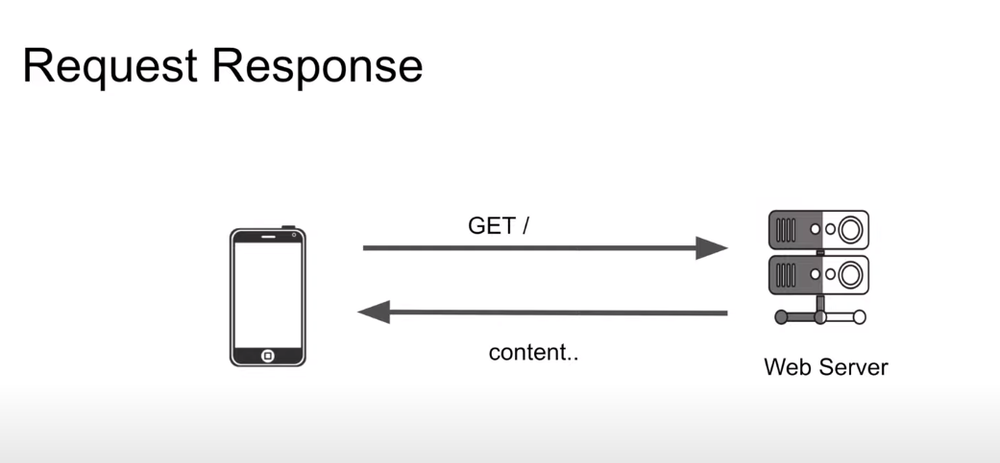
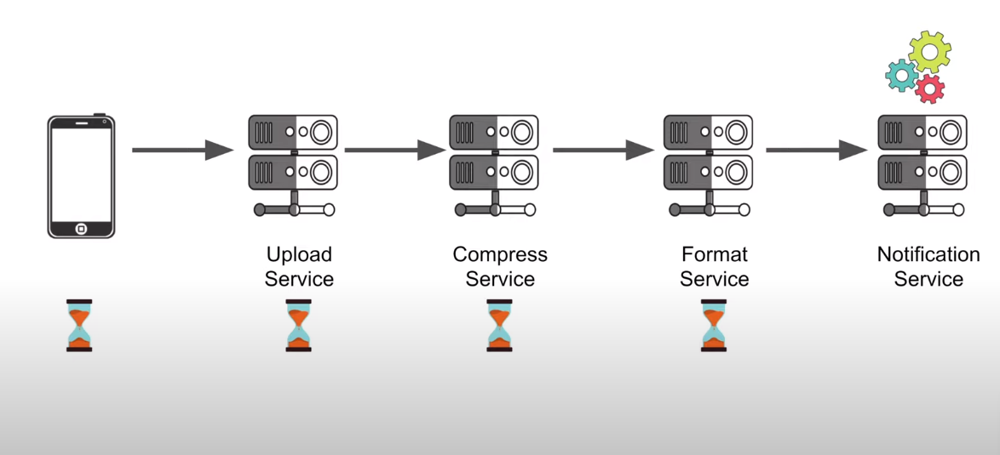
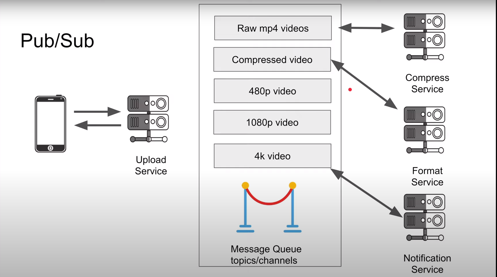
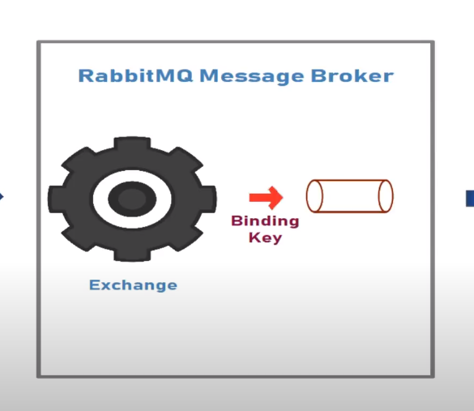
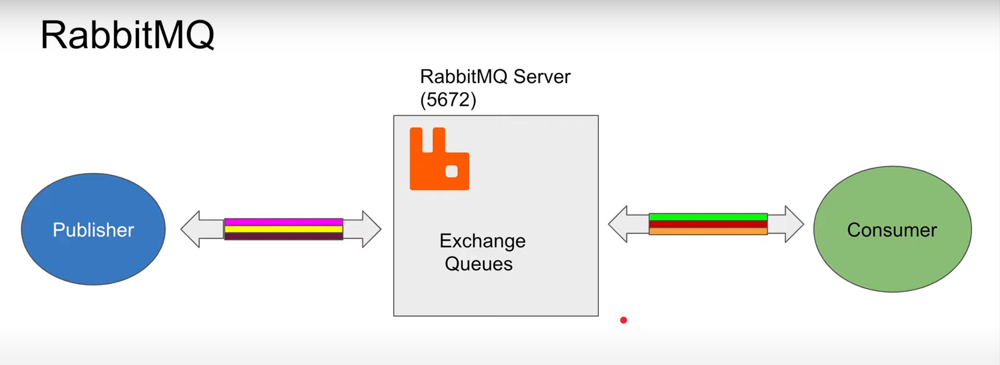
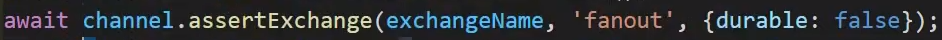
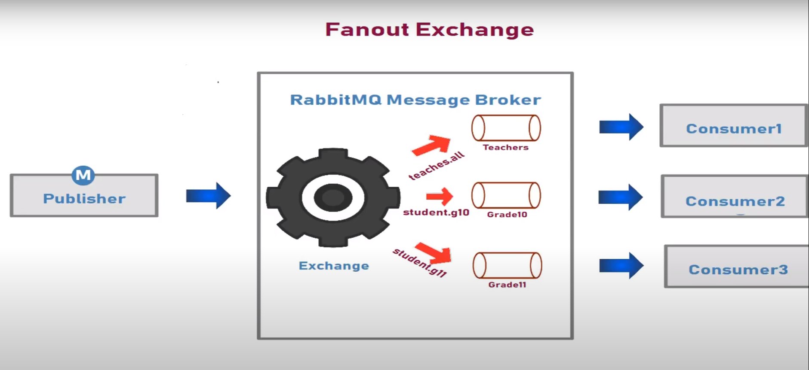
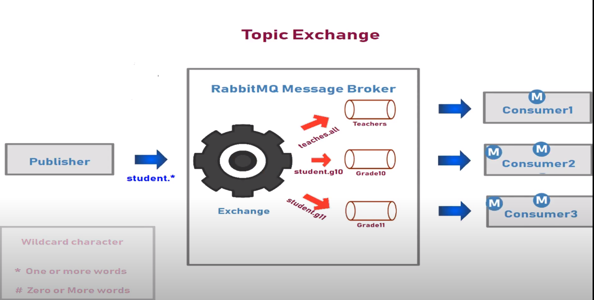
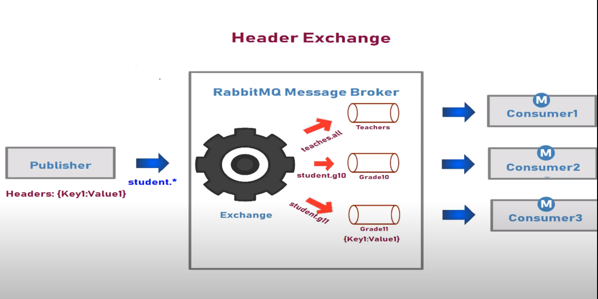

# RabbitMQ-Node   
### What is Message Queue ?
Message queuing makes it possible for applications to communicate asynchronously, by sending messages to each other via a queue. A message queue provides temporary storage between the sender and the receiver so that the sender can keep operating without interruption when the destination program is busy or not connected.
When to use queue ?
- when our request is in-deterministic, and we are not sure how long will it take to process the request , we use queues.
- When our request is a long-running process.
- If our process is resource hungry.

###  Request/Response 
  - It's a simple architecture where we make a request to the server, and we wait for the response.
  - 
  - Req/Res architecture isn't a good choice for where there's a chain of requests being made and each service is dependent upon other service's response , not only it increases the time but also if something breaks in the middle everything else gets broken as well.
  - 
  - #### Pros 
    - Simple 
    - Stateless(HTTP)
    - Scalable
  - #### Cons
    - Bad for multiple receivers
    - High Coupling 
    - Both Server and Client server have to be running.

### Publish/Subscribe
- It is a kind of architecture where we simply just publish or transfer the required information to the message queue which is also referred to as topics or channels and that publisher is immediately responded back.
- The best part about this archi. is that the one who is publishing the message , doesn't know who will consume it thus making decoupling possible.
- 
- #### Pros 
  - Scales with multiple receivers.
  - Great for microservices.
  - Loose Coupling (if any service goes down , it won't affect other services)
  - Works if receiver(subscriber) is down.
- #### Cons 
  - Message Delivery Issues 
    - As a Publisher what if you don't receiver any acknowledgement from the queue that your message has been published?
  - Complexity 
    - We will have to continuously keep track on the status of the publisher and consumer to know their status.
    - Management complexity that comes when publisher is soo fast that it's just pumping out messages and one of the many consumer isn't strong enough to manage it So these incoming messages gets on hold , now what do you do with these awaited messages? (read about long polling that's used by Kafka)
  - Network Saturation
    - It basically means that if there are not any new messages on the topic then network request made just get saturated over time.

### RabbitMQ 
- Parts of RabbitMQ  
  - Rabbit MQ Server (default port : `5672`) (can be distributed as well)
  - Publisher 
    - Establishes stateful TCP connection between itself and rabbitmq server , It's a two-way communication.
    - on top of TCP , it uses AMQP (Advanced Message Queue Protocol).
  - Consumer 
    - Connects to server using two stateful Bi-directional TCP connection , much like Publisher.
    - Server pushes the message to the consumer.
  - Channel
    - it is like a logical connection in the main connection (kinda like sub-connection or mini connection) it helps rmq to separate multiple consumers inside that connection.
    - Multiple consumers can share a same TCP connection.
  - Pub and Sub are not aware of queue, but they are aware of something called exchanges.
  - Binding key helps the exchange to bind with the queue , the binding-key is used with the queue. It is the key with which the queue is registered in the exchange.
  - The routing-key is used with the message. It is the key which will decide which queue(s) does this message should be routed to.
    - 
- RmQ guarantees at least once delivery.
  - 
- Exchanges : They are basically the middleman that transfers the message to the routing keys. 
  - **Fanout Exchange :** it allows exchange to broadcast message to all the consumers.
    - Basically it routes messages to all the queues which are bound to that particular exchange.
    - 
  - Direct Exchange : allows the exchange to send the message to a particular queue only. It
  - Topic Exchange : Similar to the Direct exchange but it can handle wildcard characters (* ONE OR MORE WORDS || # Zero or more words) and can send message to more than one queue.
    - 
  - Header Exchange : uses headers to route the message.
    - 
//https://www.youtube.com/watch?v=zZ3Owtryv8Q